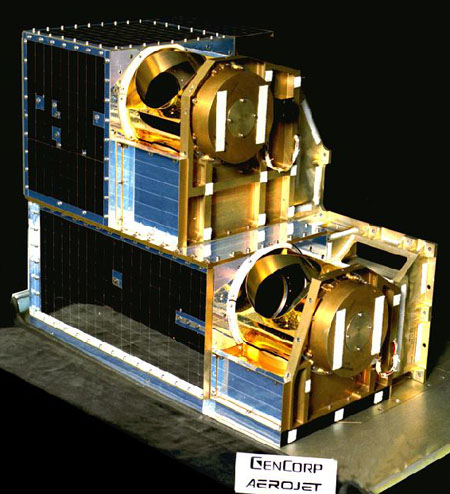
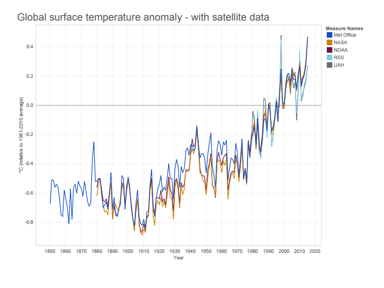

Climate Science Review: Satellite-Based Temperature Measurements
========================================================
author: Valentina Emanuele Jervis
date: 09/17/2017
autosize: true

HISTORICAL DEVELOPMENT
========================================================

- Polar orbitting atellites have been used to measure tropospheric temperatures since 1978

- Geostationary satellites help monitor and predict weather and environmental events such as tropical environmental systems, tornadoes, flash floods, dust storms, volcanic eruptions, forest fires, etc. 

DATA SOURCES
===

- Three major datasets of global surface temperature:
    
    HadCRUT4 (UK)
    
    GISTEMP-GISS (US)
    
    NOAA-MLOST (US)

METHODS OF ANALYSIS
==========

The way they measure temperature is with something called passive microwave radiometry. 

Two major data analysts:

-Remote Sensing Systems (RSS)

-University of Alabama in Huntsville (UAH)

INSTRUMENTS
===

-MSU: Microwave Temperature Sounding (1978)
  Polar orbitting satellites
  (50.3-57.97GHz)

-AMSU: Advanced Microwave Sounding Unit (1998)

  a. AMSU-A: Global atmoshperic temperature (23-90 GHz)
  
  b. AMSU-B: Humidity sounder
  
-ATMS: Advanced Technology Microwave Sounder (2011)
  Similar to AMSU but smaller, more powerfull and imporved spatial coverage and content
  
MORE ON INSTRUMENTS...
===

AMSU-A:

-Smaller ecological footprints

-Higher resolutions

-Measure temperatures higher in the stratosphere

***

EARTH IS HEATING ANYWAY
===
While the data and the instruments measure fundamentally different quantities, all the data shows an evident warming trend: 0.11 degrees Celsius per decade since 1978 
***

AREAS OF UNCERTAINTY
===

Surface/in situ data:

- Less processed
- Less global

vs. 

Satellite data: 

- More sensitive structural and statistical   uncertainty
- Accurate system for long-term monitoring in a global scale

FALSE DICHOTOMY
===

Can there be a midpoint between both?

Can we take advantage of both?

===
Thanks for listening!
***

