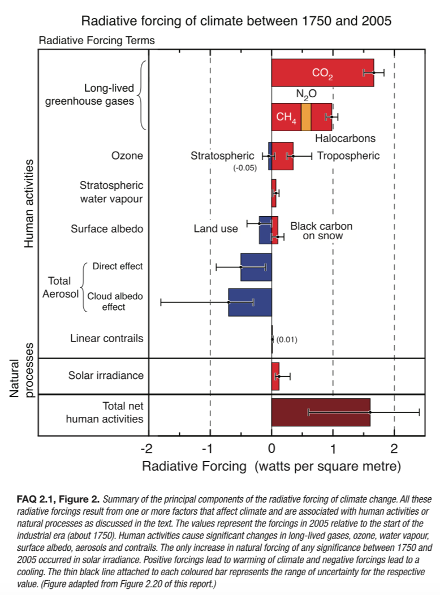
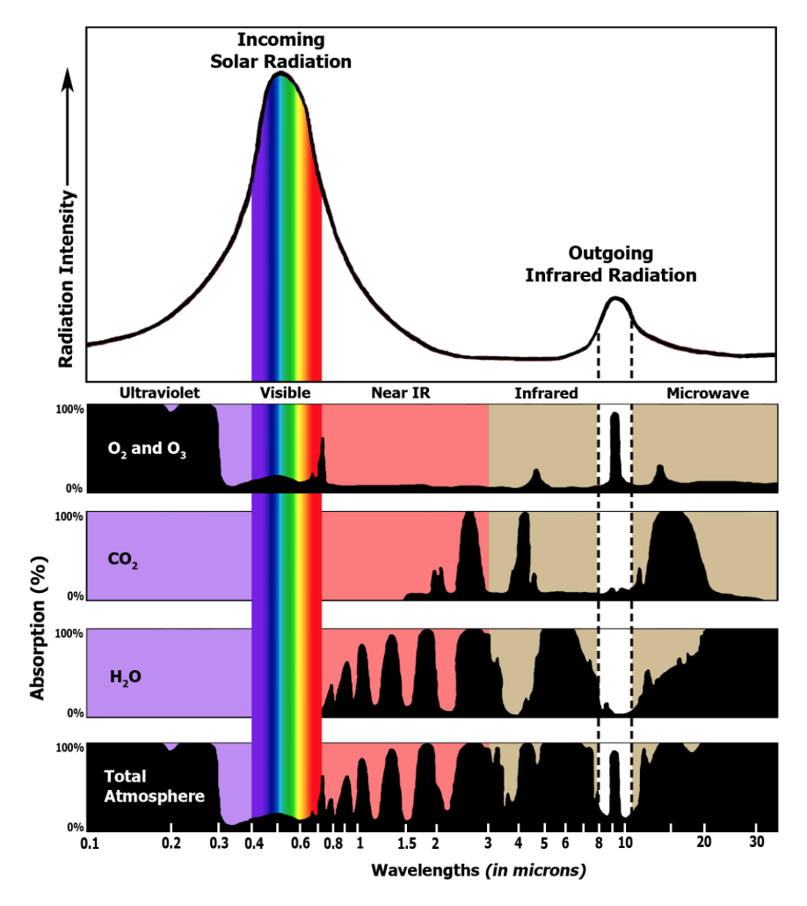
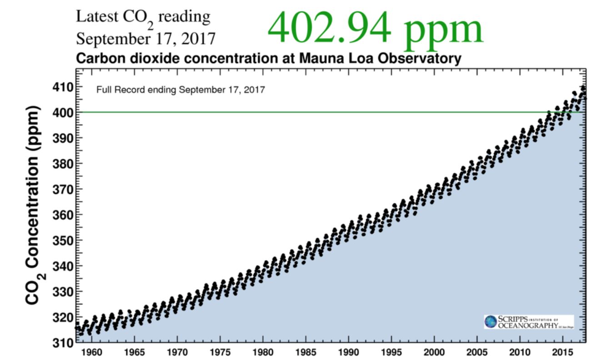

Radiative Gases
========================================================
author: Kirara Tsutsui
font-family: Times
date: Sept. 10, 2017
autosize: true
width: 1200
height: 1600

Definitions and Methods
========================================================
Radiative Forcing (RF) = a change in Earth’s energy balance between incoming solar radiation energy and outgoing thermal IR emission energy when the variable is changed while all other factors are held constant. 

AR5 defines RF as "the change in energy flux caused by a driver and is calculated at the tropopause or at the top of the atmosphere" 
Its units are Watts per square meter.

What It Actually Means
==================

Radiative forcing can be used to estimate a subsequent change in equilibrium surface temperature (ΔTs) arising from that forcing via the equation:
ΔTs = λΔF
where λ is the climate sensitivity, usually with units in K/(W/m2), and ΔF is the radiative forcing.

Human-based emissions are estimated based on two kinds of data:
1. volume of the activity producing the emissions
2. emission factors used to convert the volume of activity into emissions

****** 

========================================================
Contribution of a given gas to RF depends on its ability to absorb IR emitted by Earth's surface and atmosphere = its fundamental spectroscopic properties of the molecule 

RF is effective when the molecule absorbs at wavelengths where the atmosphere is not already strongly absorbing

*******

History and Development
==========

1820s Joseph Fourier: Greenhouse Effect
1859 John Tyndall: Ratio spectrophotometer; Concluded that water vapor = strongest absorber of radiant heat
1958 Charles David Keeling 
*******

Data Sources and Methods of Analysis
==================

-IPCC's Assessment Reports

-National Academies of Sciences, Energy, and Medicine: "Radiative Forcing of Climate Change"

-AGU Publications: "Radiative forcing of carbon dioxide, methane, and nitrous oxide: A significant revision of the methane radiative forcing" (Research paper)

-Journal of Climate Volume 28: "The Dependence of Radiative Forcing and Feedback on Evolving Patterns of Surface Temperature Change in Climate Models" (Research paper)

-General information from NASA, USEPA, IPCC

How Do Human Activities Contribute to RF?
===================

Human activities contribute to trends in RF and ultimately to climate change by causing fluctuations in Earth's atmosphere in the amounts of GHGs, aerosols, and cloudiness.

Changing the atmospheric abundance of GHGs and aerosols can lead to a warming or cooling of the climate system. 

Four principal GHGs due to the Anthropogene:

1. Carbon Dioxide

2. Methane

3. Nitrous Oxide

4. Halocarbons 

Areas of Uncertainty
===================
-Decrease in the atmospheric CH4 growth rate and its implications for future changes in atmospheric burden 
-CH4 is removed by reaction with the hydroxyl free radical (OH)

-The extent of aerosols in offsetting anthropogenic RF

-Life expectancy of different compounds and its repercussions to RF and the climate system

-Overrepresentation of future greenhouse effects due to imcomplete description of the atmospheric removal processes

-Water

Politicization of Evidence and Conclusions
===================

-Emphasis on emission implications could be sacrificed depending on what data says about the absorbtion rate of compounds

-New studies regarding non-anthropogenic effects on RF could be utilized to conceal human-induced effects

